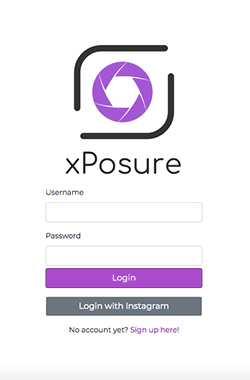
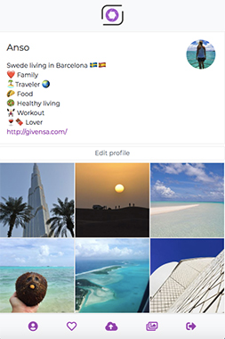
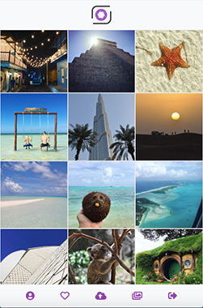
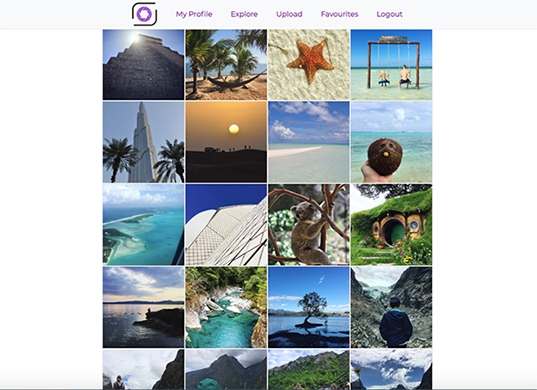

# xPosure 

## About the app
xPosure was my second project at Ironhack Barcelona. In is a photo sharing web application with Instagram authentication and CRUD operations. It is built with Node, Express, Mongoose, HTML w/ Handlebars, CSS, JavaScript, REST APIs. 

   

It supports social login using Instagram as well as image uploads to an external server. Further it also supports liking other user images and exploring content from others to get inspiration and follow them.

The app is responsive and was built in only 6 days.





------


## User Stories

**HOME**

As a user, I want to see a nice landing page with info about the app and login , so that I can understand what it is about and how to join.


**SIGNUP**

As a user, I want to sign up easily, so that I can start managing and sharing my media.


**MY MEDIA**

As a user, I want to see all all my imported media in one site , so that I can have an overview and deciide what to do with it.

**MEDIA EDIT**

As user, I want to be able to change the data and settings of my media, so that I can optimise, organise, and share it. 

**PHOTO VIEW**

As a user, I want to have a full-scale picture view, so I can see all the details

**FEED**

As a user, I want have a feed of pictures from other users, so I can expore what aothers have shared.

**LIKE VIEW**

As a user, I want to see all my favorite photos in one page.

**MAP EXPLORE** (Backlog)

As a user, I want to see a map with tagges pictures, so I can see what pictures were taken around me or around a location I'm interested in. 


------


## Data Models

### user.js
```js
const userSchema = new Schema({
  // USING INSTAGRAM SCHEMA
  displayName: String,
  homePage: String,
  image: String,
  bio: String,
  // END OF USING INSTAGRAM SCHEMA
  firstName: String,
  lastName: String,
  email: String,
  username: String,
  passwordHash: String,
  profile: {
    bio: String,
    image: String,
    location: String
  },
  media: [],
  followers: [],
  following: [],
  likes: [],
  saved: [],
  activityLog: [],
  timestamp: {
    createdAt: { type: Date, default: Date.now }
  }
});
```

### media.js
```js
const mediaSchema = new Schema({
  standard_resolution: String,
  thumbnail: String,
  cloudId: String,
  thumbnail_cloudId: String,
  meta: {
    type: metaSchema
  },
  creatorId: { type: Schema.Types.ObjectId, ref: 'User' },
  visibility: { type: Boolean, default: true },
  likes: [],
  saves: [],
  tags: [],
  timestamps: {
    createdAt: { type: Date, default: Date.now },
    updatedAt: { type: Date, default: Date.now }
  }
});

const metaSchema = new Schema({
  media_type: String,
  geolocation: [Number],
  camera: String,
  description: String
});

```

## Routes


### index.js (public)

| Route | HTTP Verb | Description           |
| ----- | --------- | --------------------- |
| /     | GET       | render home screen w/ |
| /     | POST      | Log-in                |

### auth.js (public)

| Route   | HTTP Verb | Description        |
| ------- | --------- | :----------------- |
| /signup | GET       | render signup form |
| /signup | POST      | Create new user    |

### explore.js (protected)
| Route           | HTTP Verb | Description                        |
| --------------- | --------- | ---------------------------------- |
| /explore        | GET       | render explore view, get all media |
| /explore/:filter | POST      | Send query for filtered feed       |
| /explore/:filter | GET       | Render filtered feed               |
| /explore/:media_id       | POST      | Send query for media_id            |
| /explore/:media_id       | GET      | Render image in view               |


### mymedia.js (protected)
| Route            | HTTP Verb | Description                        |
| ---------------- | --------- | ---------------------------------- |
| /mymedia         | GET       | render myMedia view, get all media |
| /mymedia/:filter  | POST      | Send query for filtered media      |
| /mymedia/:filter  | GET       | Render filtered media              |
| /mymedia/manage/:media_id | POST      | Send query for media_id            |
| /mymedia/manage/:media_id | GET      | Render image in view               |
| /mymedia/manage/:media_id | PATCH/PUT | Change media in DB                 |
| /mymedia/manage/:media_id | DELETE     | Delete media in DB                 |
|                  |           |                                    |


### Demo
[App] (https://xposure-app.herokuapp.com/)


